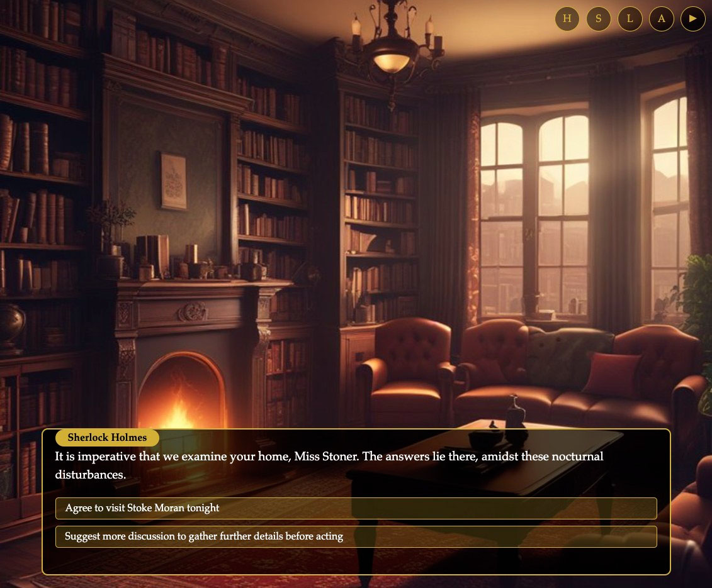
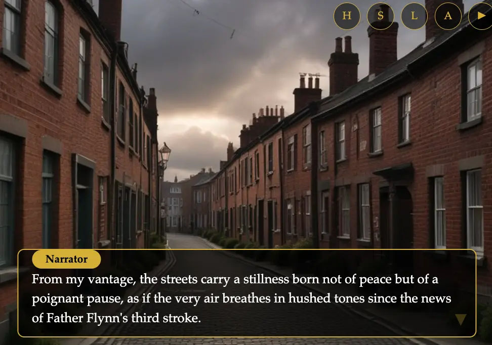

# PlotTwist


## 📚 Transform Books into Interactive Visual Novels

PlotTwist is a web app that turns any book into an interactive visual novel experience. Upload your favorite book and watch it transform into a visual novel with AI-generated scenes, characters, and dialogue.

My team submitted this for an MIT Sundai Club hackathon with the theme: Games.

## ✨ Features

- **PDF Book Upload**: Upload any book in PDF format
- **AI-Powered Analysis**: Automatically extracts characters, plot points, and key scenes
- **Visual Novel Generation**: Transforms the book into an interactive visual novel format
- **Character Visualization**: AI-generated character images based on book descriptions
- **Scene Backgrounds**: Beautiful backgrounds for each scene
- **Interactive Dialogue**: Experience the story with dialogue choices

## 📸 Screenshots

Here's a glimpse of PlotTwist in action:





## 🛠️ Technology Stack

### Frontend
- HTML/CSS/JavaScript
- Responsive design for desktop and mobile

### Backend
- Python with FastAPI
- PDF processing with PyPDF
- AI integration with OpenAI and Google Generative AI
- Image generation with Replicate

## 🚀 Quick Start

1. Clone the repository
2. Install backend dependencies:
   ```
   cd backend
   pip install -r requirements.txt
   ```
3. Start the backend server:
   ```
   uvicorn main:app --reload
   ```
4. Open the frontend in your browser:
   ```
   cd ../frontend
   # Use any simple HTTP server, e.g.:
   python -m http.server 8080
   ```
5. Visit `http://localhost:8080` in your browser

## 🎮 How to Use

1. Upload a book in PDF format
2. Wait for the AI to analyze the book (this may take a few minutes)
3. Once processing is complete, enjoy your book as an interactive visual novel!

## 🧠 Behind the Scenes

PlotTwist uses a combination of AI technologies to:
1. Extract and understand the narrative structure of books
2. Identify key characters and their relationships
3. Generate visual representations of characters and scenes
4. Create an interactive dialogue system based on the original text

## 👥 Team

Created during a hackathon by MIT Sundai Club members Jordan Tian, Nicolas Barraud, Pavel Trukhanov, Linna Li, Hengxu Li and Elaine Zhang.

## 📝 License

This project is open source and available under the [MIT License](LICENSE).

## 🙏 Acknowledgements

- MIT Sundai Club organizers Serge Vasylechko, Brandon Li, Artem Lukoianov, Maria Gorskikh and Konstantina Yaneva.
- MIT Media Lab for the space.

---

*Note: This project was created in just under 8 hours during a hackathon. While functional, it may contain bugs or limitations due to the time constraints.*
